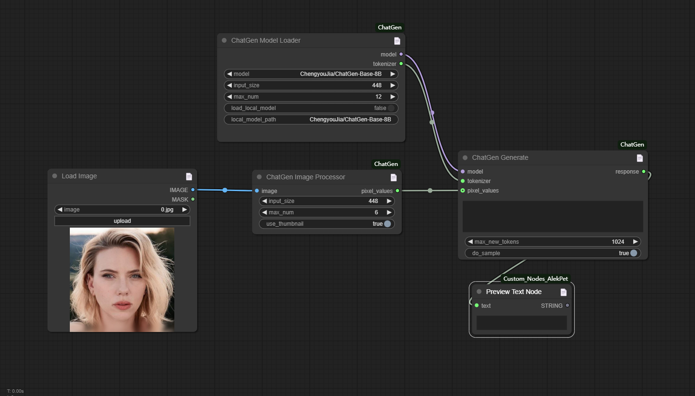

# ComfyUI nodes to use ChatGen 

https://github.com/chengyou-jia/ChatGen

## Install

- 推荐使用管理器 ComfyUI Manager 安装（On the Way）

- 手动安装：
    1. `cd custom_nodes`
    2. `git clone https://github.com/leeguandong/ComfyUI_ChatGen.git`
    3. 重启 ComfyUI

## Stars

